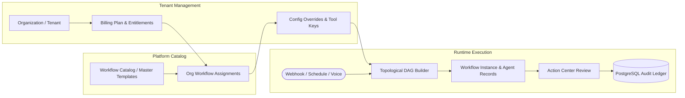
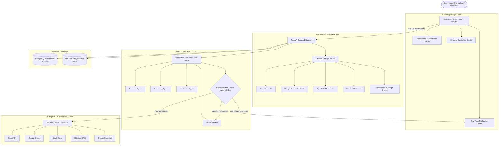

# 🚀 SMBFlow — Intelligent Multi-Agent AI Operations & Workflow Platform
> **Master Architecture, Feature Reference & Hackathon Presentation Guide**  
> *An enterprise-ready autonomous operations platform combining multi-agent reasoning, intelligent LiteLLM task routing, visual DAG execution, and Human-in-the-Loop governance.*

---

## 🎯 1. Executive Summary & Problem-Solution Fit

### 🔴 The Problem
* **Operational Fragmentation:** Growing businesses run on 8–15 disconnected tools (Gmail, HubSpot, Google Sheets, Slack, Google Calendar). Employees spend 30%+ of their workweek copying data, drafting repetitive replies, and reconciling spreadsheets.
* **Fragility of Traditional Automations (Zapier/Make):** Traditional automation tools are rigid and rule-based. If an invoice format changes, an email contains typos, or unstructured text arrives, the workflow immediately crashes because it lacks AI reasoning.
* **Uncontrolled Risk of Autonomous AI:** Pure autonomous AI agents hallucinate and make costly, irreversible mistakes (sending unverified emails to clients, approving incorrect invoice payments, or publishing unvetted campaigns) without human supervision.
* **Prohibitive LLM API Costs:** Calling heavy frontier models (like Claude 3.5 Sonnet or GPT-4o) on every single automated step causes cloud bills to skyrocket.

### 🟢 The SMBFlow Solution
SMBFlow is a **multi-tenant autonomous operations platform** that combines:
1. **7-Layer Multi-Agent Architecture:** Specialized autonomous agents (Research, Reasoning, Drafting, Verification, Consensus, Execution) that collaborate to solve complex business operations.
2. **Intelligent LiteLLM Task Routing & Cost Optimization:** Routes each task to the exact right model tier (sub-cent models for triage, heavy frontier models for precision reasoning), saving up to 70% in token costs.
3. **Zero-Risk Human-in-the-Loop (Action Center):** High-stakes steps are safely held at Layer 6 Approval Gates until a supervisor gives 1-click approval.
4. **Visual Canvas & Dynamic AI Copilot:** Natural language and real-time voice interface allowing anyone to generate, inspect, and execute DAG workflows visually.

---

## 💡 2. Key Architectural Novelties (Why SMBFlow Wins)

```
┌──────────────────────────────────────────────────────────────────────────────┐
│                           KEY PLATFORM NOVELTIES                             │
├──────────────────────────┬──────────────────────────┬────────────────────────┤
│  1. 7-Layer Consensus   │  2. LiteLLM Cascading   │ 3. Human-in-the-Loop   │
│     & Verification       │     Cost Optimizer       │    Approval Gates      │
│  Multi-agent self-check  │  Auto-routes tasks to    │  Prevents hallucinations│
│  before taking action    │  optimal price/perf tier │  with 1-click sign-off │
├──────────────────────────┼──────────────────────────┼────────────────────────┤
│  4. Context Pruning      │  5. Dynamic AI Copilot   │ 6. Real-Time Event Hub │
│  Only passes required    │  Personalizes prompts    │  Live WebSocket push   │
│  node state to save $    │  by industry & run history│  for instant approvals │
└──────────────────────────┴──────────────────────────┴────────────────────────┘
```

1. **Adversarial Verification Agent:** Before any deliverable is created, a dedicated Verification Agent audits calculations, checks OCR discrepancies against purchase orders, and tests against enterprise safety constraints.
2. **Cascading Self-Healing Model Router:** Built on LiteLLM with automatic failover (Groq $\rightarrow$ Gemini $\rightarrow$ OpenAI $\rightarrow$ Claude). Workflows never crash from single-provider rate limits or outages.
3. **Context Pruning (Selective Data Propagation):** Instead of naively passing bloated chat transcripts across every node, SMBFlow passes only the explicit inputs declared in the DAG dependency tree, slashing input token consumption by up to 60%.
4. **State Machine Rehydration & Replay:** Every run is recorded as an immutable execution record in PostgreSQL (`workflow_instances`), capturing exact node durations, input/output JSON payloads, and token consumption for 100% auditable enterprise compliance.

---

## 🧠 3. Intelligent Task Routing & LiteLLM Cost Optimization

### 🔹 How Multi-Model Task Routing Works
Different operational tasks require vastly different levels of intelligence. Running GPT-4o to simply extract an email address is wasteful; running an 8B model to audit complex multi-page financial ledgers leads to errors.

SMBFlow implements a **Task-to-Tier Mapping Engine** managed by LiteLLM:

| Task Tier | Assigned Models | Typical Latency | Cost per 1K Tokens | Tasks Handled |
| :--- | :--- | :--- | :--- | :--- |
| **Fast / Mini** | Groq Llama 3.1 8B, Gemini Flash, GPT-4o-mini | ~150–300 ms | $\approx \$0.0001$ | Email triage, intent classification, signal intake, parameter extraction |
| **Balanced** | GPT-4o-mini, Gemini 2.5 Flash, Llama 3.3 70B | ~400–800 ms | $\approx \$0.0008$ | Multi-channel copywriting, audience segmentation, Slack notification formatting |
| **Heavy / Precision** | Claude 3.5 Sonnet, OpenAI GPT-4o | ~1.2–2.0 s | $\approx \$0.0050$ | PDF Invoice OCR, discrepancy math reconciliation, complex logic & decision trees |
| **Visual Creative** | Pollinations AI Engine + Gemini Fallback | ~1.5–3.0 s | Near-zero / Included | Branded social ads, 3D product heroes, problem-solution visual infographics |

### 🔹 4-Level Budget Governor
SMBFlow features a configurable **Budget Governor** that can be set per organization:
* **Level 0 (Max Accuracy):** Uses top-tier models across all nodes for mission-critical enterprise workflows.
* **Level 1 (Balanced - Default):** Downgrades data intake and verification to fast models while preserving heavy models for core reasoning.
* **Level 2 (Aggressive Optimization):** Downgrades reasoning and drafting by one tier, truncating long chain-of-thought traces.
* **Level 3 (Budget First):** Enforces fast/mini models across all non-critical nodes, passing condensed summaries between steps.

---

## ⚙️ 4. Multi-Agent Lifecycle & Business Logic

### 🔹 How Agents are Created, Stored, and Assigned


1. **Template Catalog (`workflow_catalog`):** Master repository of platform workflow products (Product Launch Sprint, Invoice OCR, Lead Scoring, Email Triage).
2. **Organization Entitlement (`organization_workflow_assignments`):** Administrators assign specific workflows to organizations with custom parameters, approval thresholds, and schedule configurations.
3. **Topological DAG Execution:** When a workflow is triggered, SMBFlow builds an execution graph using Kahn’s algorithm to validate dependencies, detect cycles, and execute independent nodes in parallel.
4. **State Accumulation:** Each node receives structured inputs from its upstream dependencies (`AgentInput`), processes them through the assigned agent and tools, and outputs a validated JSON schema (`AgentOutput`).
5. **FinOps & Audit Logging:** Every agent execution writes to `agent_run_records` and `usage_records`, logging exact prompt tokens, completion tokens, latency (ms), model used, and USD cost.

---

## 🏛️ 5. Full System Architecture



---

## ⚡ 6. Core Platform Features

### 🎨 A. Interactive Workflow Canvas with AI Support
* **Live Visual Node Graph:** Renders workflows as interactive DAGs with animated flow pulses, status badges, and duration metrics.
* **Natural Language Synthesis:** Speak or type a workflow instruction (e.g., *"Extract vendor invoices from Gmail, verify against Sheets, and ping Slack"*), and the AI compiles it into runnable DAG nodes.
* **Node Inspection Drawers:** Click any node in real time to inspect inputs, parameters, raw LLM outputs, and latency.

### 🔌 B. Pre-Built Connected Tool Ecosystem
* **Gmail:** Scans unread inbox messages, retrieves threads, and extracts PDF attachments.
* **Google Sheets:** Queries purchase orders, checks inventory balances, and writes audit rows.
* **Slack:** Sends rich block-kit alerts, sales notifications, and escalation summaries to channels or DMs.
* **HubSpot CRM:** Ingests contact webhooks, updates lead lifecycle stages, and enriches records.
* **Google Calendar:** Schedules campaign drops, payment reminders, and follow-ups.
* **Encrypted Tenant Isolation:** All OAuth tokens and API credentials are encrypted with AES-256 per organization.

### 🛡️ C. Action Center for Human Review (HITL)
* **Zero-Risk Operations:** AI handles drafting and parsing, but **critical outbound actions pause at Layer 6 Approval Gates**.
* **1-Click Supervisor Controls:** Supervisors can **Approve**, **Reject**, or **Request Revision** with one click.
* **Full Audit Trail:** Captures supervisor identity, decision timestamp, and before/after diffs in PostgreSQL.

### 🔔 D. Real-Time Notification Center
* **Top-Bar Notification Hub:** Live bell icon with unread badge counter.
* **Dual-Scope Tabs:** Filter instantly between **Personal** (user-specific tasks) and **Global** (system-wide supervisor escalations).
* **1-Click Approval from Popup:** Review and approve pending workflow deliverables directly from the notification dropdown via WebSockets without leaving your screen.

### 🎙️ E. Dynamic AI Copilot & Voice Terminal
* **Personalized Context Engine:** Automatically suggests recommended questions and actions based on your organization's industry, active runs, and pending approvals.
* **Real-Time Voice Assistant:** Hands-free voice input with live animated waveform equalizer and speech-to-text.
* **Context Document Upload:** Attach PDFs, CSVs, or text briefs to ground queries in company data.
* **Strict Query Safety:** Unrecognized or casual queries receive polite guidance directing the user to valid workflow actions (zero hallucinated pipelines).

---

## 💼 7. Live Demo Workflows

| Workflow | Operational Problem Solved | Agents & Tools Used | Demo Highlight |
| :--- | :--- | :--- | :--- |
| **🚀 Product Launch Sprint** | Creates complete marketing campaigns from a raw product brief. | Claude 3.5, Google Calendar, Slack, Image Router | **History Switcher** (flip between runs), on-screen visual image generation, strict input validation. |
| **📄 Invoice OCR & Reconciliation** | Ingests PDF invoices and reconciles with PO ledgers. | Gmail, Claude 3.5 OCR, Google Sheets, Google Calendar | **Variance Tolerance Gate** (auto-escalates discrepancies over $50 to Action Center). |
| **🎯 Inbound Lead Scoring** | Qualifies inbound CRM prospects with enriched firmographics. | HubSpot, GPT-4o, Slack | **Instant Slack Alerts** for Tier 1 prospects with AI-generated talking points. |
| **📬 Email Summarizer & Triage** | Conquers inbox overload by categorizing and drafting replies. | Gmail, Claude 3.5, Slack, Action Center | **Urgency Scoring (0–100)** and automated draft staging before sending. |

---

## 🎤 8. Hackathon Winning Presentation Script

### ⏱️ The 60-Second Elevator Pitch
> *"Growing businesses waste hundreds of hours manually moving data between Gmail, Sheets, HubSpot, and Slack. Traditional tools like Zapier break when formats change, while autonomous AI agents are too risky because they hallucinate without human oversight.*  
>  
> *SMBFlow solves this with a **7-layer multi-agent architecture**, **intelligent LiteLLM cost routing**, and a **built-in Human-in-the-Loop Action Center**. Our platform executes complex workflows across everyday tools, routes tasks to the most cost-effective AI model to cut token bills by up to 70%, and pauses critical actions for 1-click supervisor approval. It’s enterprise automation that is smart, affordable, and 100% safe."*

### 🎮 The 2-Minute Live Demo Flow
1. **Show the Dynamic Copilot (`/copilot`):** Demonstrate voice input and industry-personalized recommendation pills.
2. **Execute Product Launch Sprint (`/workflows/product-launch`):** Click **Run Pipeline**, watch the live DAG nodes generate ad copy, visual assets, and calendar schedules, and use the **Run History Switcher**.
3. **Demonstrate Action Center & Notification Hub (`/escalations`):** Show the deliverable held safely at the approval gate, open the top **Notification Bell**, and perform a **1-click live approval**.
4. **Show FinOps Cost Telemetry (`/dashboard`):** Highlight real-time token tracking and cost accounting in the audit logs.

---

## ❓ 9. Judge Q&A Cheat Sheet

| Question | Winning Answer |
| :--- | :--- |
| **"How is this different from Zapier or n8n?"** | *"Zapier is deterministic: if an invoice format or email layout changes, the automation crashes. SMBFlow uses multi-agent reasoning to read unstructured data, generate creative deliverables, optimize token costs, and hold high-stakes steps for human approval."* |
| **"How do you optimize LLM costs?"** | *"Our LiteLLM router assigns tasks to 4 distinct tiers: simple triage goes to fast sub-cent models (Groq/Gemini Flash), while heavy models (Claude 3.5) are reserved for complex OCR and reasoning. We also prune context across DAG nodes, saving up to 60% in tokens."* |
| **"What prevents the AI from making unauthorized mistakes?"** | *"All high-impact actions (sending client emails, paying invoices, public posts) are gated at Layer 6 in the Action Center until an authorized supervisor approves them."* |
| **"How do you handle provider downtime?"** | *"Our self-healing router automatically cascades to fallback providers (Groq $\rightarrow$ Gemini $\rightarrow$ OpenAI $\rightarrow$ Claude) in real time with zero downtime."* |
