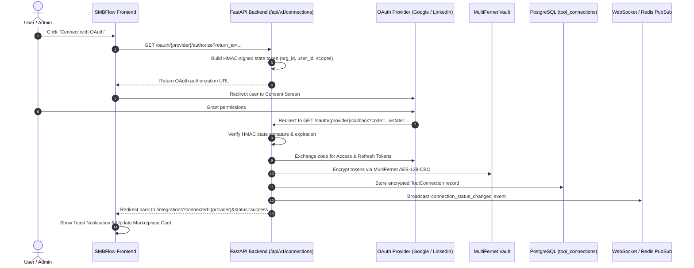

# SMBFlow Tool Connections & Integrations Architecture

## 1. Core Architecture Principles

1. **Authentication vs. Tool Connections Separation**:
   - **SMBFlow Authentication**: How a user logs into the platform (Email/Password, Supabase Auth).
   - **Tool Connections**: Third-party service authorizations (Google Workspace, LinkedIn, Slack, HubSpot, Stripe) that workflows consume.
2. **Persistent Provider Marketplace**:
   - The integration marketplace always renders all supported providers regardless of whether 0 or 10 tools are connected.
   - Provider definitions are stored in the canonical `PROVIDER_CATALOG` (`integrations/registry.py`).
   - Counts are calculated and clamped:
     - `all = total_registered_providers`
     - `connected = active_connections_count`
     - `available = max(0, all - connected)`
3. **Unified Google Workspace**:
   - Single external connection exposes 16 independent capabilities with granular scope mappings across Gmail, Calendar, Google Meet REST API v2, Drive, Docs, Sheets, and Slides.
   - Connecting Google Workspace once enables all workflows in the organization to utilize authorized Google capabilities without re-authentication.
4. **Multi-Tenant & Scope Isolation**:
   - **Organization Scope**: (e.g. Slack, HubSpot, Stripe, Google Workspace) Shared across the organization.
   - **Personal Scope**: (e.g. Personal LinkedIn Profile) Isolated to the individual user.
5. **Capability-Level Access & Workflow Runtime Resolution**:
   - Workflows declare required capabilities (e.g. `google.gmail.send`, `google.meet.transcript.read`, `linkedin.post.create`).
   - `resolve_capability_requirement(db, org_id, user_id, capability_id)` verifies if an active connection exists.
   - If missing, returns structured `{ "status": "connection_required", "provider": "google_workspace", "message": "...", "connect_url": "..." }`.

---

## 2. Supported Providers & Capabilities

| Provider Key | Display Name | Auth Type | Scope Level | Capabilities Count |
| :--- | :--- | :--- | :--- | :--- |
| `google_workspace` | Google Workspace | OAuth 2.0 | Organization | 16 Capabilities |
| `linkedin` | LinkedIn | OAuth 2.0 | Personal | 3 Capabilities |
| `slack` | Slack Notifications | Bot Token / API Key | Organization | 3 Capabilities |
| `hubspot` | HubSpot CRM | API Key | Organization | 3 Capabilities |
| `stripe` | Stripe Payments & Billing | API Key | Organization | 3 Capabilities |
| `rest_api` | Custom REST Connector | API Key / Bearer | Organization | 2 Capabilities |

---

## 3. Canonical OAuth 2.0 Lifecycle



---

## 4. Workflow Capability Check

Before running any node requiring external tools:
```python
from integrations.registry import resolve_capability_requirement

res = await resolve_capability_requirement(
    db=db,
    org_id=org_id,
    user_id=user_id,
    capability_id="google.gmail.send",
)

if res["status"] == "connection_required":
    return {
        "status": "connection_required",
        "provider": res["provider"],
        "capability": "google.gmail.send",
        "message": res["message"],
        "connect_url": res["connect_url"],
    }
```
