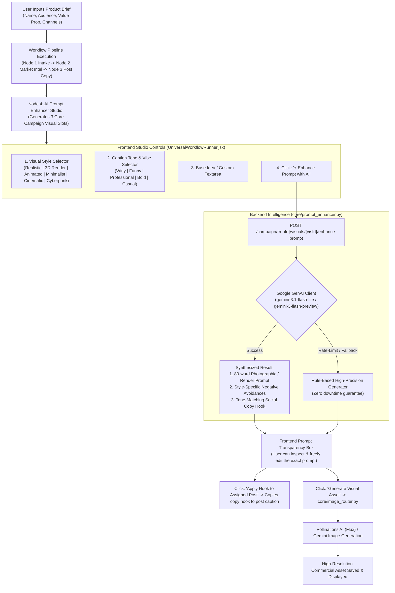

# SMBFlow AI Prompt Enhancer — Complete Implementation & Handoff Guide

> **Document Purpose:** Single-source transfer and implementation guide to copy or recreate the complete **AI Prompt Enhancer Studio** into another instance of the SMBFlow project.  
> **Target Version:** SMBFlow / OpsGrid (Multi-Agent Workflow Platform)  
> **Author:** Antigravity Engineering

---

## 1. Quick Handoff Summary: Which Files to Share?

To transfer the entire Prompt Enhancer capability to your friend's project, you only need to share **4 code files** and configure **1 settings file**:

| # | File Path | Type | What it does |
|---|---|---|---|
| **1** | [`core/prompt_enhancer.py`](file:///c:/Users/Lenovo/Desktop/CurioSparc/SMBFlow/core/prompt_enhancer.py) | **New File** | Complete AI prompt synthesis engine. Contains visual style presets (3D, Realistic, Animated, Minimalist, Cinematic, Cyberpunk), tone presets (Witty, Funny, Professional, Bold, Casual), Gemini 3.1 LLM generation, and resilient fallback logic. |
| **2** | [`core/image_router.py`](file:///c:/Users/Lenovo/Desktop/CurioSparc/SMBFlow/core/image_router.py) | **Modified** | Updated `generate()` and `_generate_pollinations()` to accept `enhanced_prompt`, `negative_prompt`, `style`, and `tone`, and route them directly to Pollinations/Gemini. |
| **3** | [`api/routers/product_launch.py`](file:///c:/Users/Lenovo/Desktop/CurioSparc/SMBFlow/api/routers/product_launch.py) | **Modified** | Adds the `POST .../visuals/{visual_id}/enhance-prompt` API endpoint and updates `GenerateVisualRequest` to receive custom enhanced prompts. |
| **4** | [`frontend/src/pages/client/UniversalWorkflowRunner.jsx`](file:///c:/Users/Lenovo/Desktop/CurioSparc/SMBFlow/frontend/src/pages/client/UniversalWorkflowRunner.jsx) | **Modified** | Complete interactive React UI for the Prompt Enhancer Studio: style selector chips, tone chips, base prompt editor, `⚡ Enhance Prompt with AI` button, exact prompt inspector box, negative prompt tags, and 1-click caption copy hook. |
| **5** | [`.env`](file:///c:/Users/Lenovo/Desktop/CurioSparc/SMBFlow/.env) | **Configuration** | Environment variables for Google GenAI / Gemini and Pollinations API keys. |

### Required Python Dependency
Ensure `google-genai` is installed in the virtual environment:
```bash
pip install google-genai structlog
```

---

## 2. System Architecture & Workflow Pipeline



---

## 3. File 1: `core/prompt_enhancer.py` (Full Code)

Place this file at `core/prompt_enhancer.py`. It is 100% self-contained and ready to run.

```python
"""
core/prompt_enhancer.py
========================
AI-powered image prompt enhancer for SMBFlow product launch visuals.

Given a product brief, visual role, desired visual style, tone, and platform:
  1. Builds a structured brand context from the campaign brief
  2. Applies style presets (Realistic, 3D Render, Animated Illustration, Minimalist, Cinematic, Cyberpunk)
  3. Applies tone presets (Witty, Funny, Professional, Bold, Casual)
  4. Uses Gemini (gemini-3.1-flash-lite / gemini-3-flash-preview) to generate:
     - Rich positive image generation prompt tailored to the visual role and selected style
     - Targeted negative prompt
     - Contextual suggested caption / hook matching the tone
  5. Includes structured fallback if LLM is unavailable
"""

import asyncio
import json
import os
import re
from typing import Any, Dict, Optional
import structlog

log = structlog.get_logger()

# ─── Platform image size specs ─────────────────────────────────────────────────
PLATFORM_SPECS = {
    "linkedin":    {"width": 1280, "height": 720,  "ratio": "16:9",  "hint": "professional, polished, B2B audience"},
    "x":           {"width": 1280, "height": 720,  "ratio": "16:9",  "hint": "punchy, bold, scroll-stopping"},
    "twitter":     {"width": 1280, "height": 720,  "ratio": "16:9",  "hint": "punchy, bold, scroll-stopping"},
    "instagram":   {"width": 1080, "height": 1080, "ratio": "1:1",   "hint": "vibrant, visually striking"},
    "facebook":    {"width": 1280, "height": 720,  "ratio": "16:9",  "hint": "clear, engaging, community feel"},
    "newsletter":  {"width": 1280, "height": 720,  "ratio": "16:9",  "hint": "clean, professional, editorial"},
    "default":     {"width": 1280, "height": 720,  "ratio": "16:9",  "hint": "professional, modern, clean"},
}

# ─── Visual Style Presets ──────────────────────────────────────────────────────
STYLE_PRESETS = {
    "photorealistic": {
        "name": "Realistic",
        "description": "Hyper-realistic commercial photography, 8k resolution, authentic studio or natural lighting, shallow depth of field, real materials, Hasselblad/Leica camera aesthetics, crisp reflections.",
        "keywords": "photorealistic commercial product photography, 8k resolution, sharp focus, studio lighting, natural depth of field, lifelike textures",
        "negative": "cartoon, 3d render, illustration, CGI, drawing, sketch, anime",
    },
    "3d": {
        "name": "3D Render",
        "description": "Ultra-detailed 3D render, Pixar/Blender/Octane render style, isometric perspective, clean glossy surfaces, soft ambient occlusion, vibrant clay or glassmorphism shaders, playful tactile feel, studio rim lighting.",
        "keywords": "3D isometric render, Octane render, Blender 3D, glossy translucent materials, ambient occlusion, smooth clay shaders, vibrant studio rim lighting, 4k 3D digital art",
        "negative": "photograph, grainy film, flat 2d, real life photo, desaturated, noisy photo",
    },
    "animated": {
        "name": "Animated / Illustration",
        "description": "Premium modern vector/digital illustration, clean bold linework, editorial tech art style like Stripe or Notion, rich harmonious color palette, flat shaded with subtle depth, dynamic composition.",
        "keywords": "modern vector illustration, digital tech editorial artwork, clean linework, vibrant flat colors, contemporary character illustration, stylish graphic design aesthetic",
        "negative": "photorealistic photo, 3d render, gritty textures, grainy film, washed out",
    },
    "minimalist": {
        "name": "Minimalist",
        "description": "Clean minimalist aesthetic, generous negative space, sleek Bauhaus composition, soft pastel or monochrome palette, elegant subtle shadows, Scandinavian design ethos.",
        "keywords": "minimalist aesthetic, clean composition, generous negative space, elegant soft shadows, sleek geometric layout, Scandinavian modern design, subdued refined color palette",
        "negative": "cluttered, busy, chaotic, high contrast, oversaturated, neon, loud",
    },
    "cinematic": {
        "name": "Cinematic",
        "description": "Cinematic wide-angle movie shot, dramatic volumetric lighting, anamorphic lens flares, rich color grading (teal & orange / filmic), atmospheric haze, high-contrast emotional visual storytelling.",
        "keywords": "cinematic film still, 35mm anamorphic lens, dramatic volumetric lighting, rich cinematic color grading, atmospheric depth, high contrast visual storytelling, movie aesthetic",
        "negative": "flat lighting, stock photo, bright cartoon, boring composition, amateur photo",
    },
    "cyberpunk": {
        "name": "Cyberpunk / Tech",
        "description": "Futuristic cyberpunk sci-fi aesthetic, glowing neon cyan and magenta accents, dark reflective wet surfaces, holographic UI overlays, high-tech dystopian or futuristic vibe.",
        "keywords": "futuristic cyberpunk aesthetic, glowing neon cyan and purple accents, dark reflective surfaces, glowing holographic UI displays, high-tech futuristic environment, vibrant synthwave lighting",
        "negative": "daylight, natural sunlight, vintage, rustic, pastel, cartoon",
    },
}

# ─── Tone Presets (Influences vibe & suggested captions) ────────────────────────
TONE_PRESETS = {
    "witty": {
        "name": "Witty & Clever",
        "vibe": "Clever, sharp, intellectual humor, relatable tech insight",
        "prompt_hint": "clever visual metaphor, smart contrasting elements, witty detail in the background",
    },
    "funny": {
        "name": "Funny & Humorous",
        "vibe": "Playful, humorous, laugh-out-loud funny observation about everyday struggles that this solves",
        "prompt_hint": "lighthearted humorous situation, exaggerated relatable emotion, fun playful energy",
    },
    "professional": {
        "name": "Professional",
        "vibe": "Authoritative, polished, executive-ready, highly credible, institutional-grade",
        "prompt_hint": "crisp professional atmosphere, executive aesthetic, premium craftsmanship, high credibility",
    },
    "bold": {
        "name": "Bold & Inspiring",
        "vibe": "Disruptive, ambitious, high-energy, confident, visionary",
        "prompt_hint": "heroic perspective, dynamic upward angle, radiant golden lighting, triumphant breakthrough mood",
    },
    "casual": {
        "name": "Casual & Friendly",
        "vibe": "Warm, conversational, approachable, authentic, no corporate jargon",
        "prompt_hint": "cozy welcoming atmosphere, warm natural sunlight, genuine relaxed interaction, approachable lifestyle",
    },
}

# ─── Visual role directions ────────────────────────────────────────────────────
ROLE_DIRECTIONS = {
    "product hero": (
        "HERO SHOT: High-impact commercial product showcase. The product itself is the unmistakable center of attention. "
        "Showcase a sleek modern device (e.g. bezel-less smartphone, tablet, or display) featuring a vibrant, beautiful, "
        "detailed UI screen with colorful interactive elements and subtle screen glow. "
        "Crisp reflections, natural depth of field, bold commercial aesthetic."
    ),
    "product / workflow / feature": (
        "FEATURE IN ACTION: Detailed close-up showing the key feature or workflow in active use. "
        "Show hands interacting with the device or a focused user engaging with the feature. "
        "The screen interface must be rich, colorful, and clearly communicate the specific value. "
        "Crisp macro view, intuitive controls, modern aesthetic."
    ),
    "customer problem / founder context": (
        "HUMAN CONTEXT & OUTCOME: An authentic, relatable story-driven editorial photograph. "
        "Show the target user experiencing the positive transformation or breakthrough moment. "
        "Natural daylight, genuine emotion, beautifully styled environment matching the industry."
    ),
}

# ─── Universal negative prompt ─────────────────────────────────────────────────
BASE_NEGATIVE = (
    "blurry, low quality, lowres, distorted, deformed, watermark, signature, "
    "garbled text, gibberish text, misspelled text, typos, wrong spelling, "
    "extra limbs, extra fingers, mutated hands, poorly drawn, jpeg artifacts, "
    "empty blank screen, plain grey display, monochrome screen, "
    "cluttered, oversaturated, overexposed, underexposed, flat lighting, "
    "stock photo cliché, amateur, ugly, dull, boring, generic"
)


def _get_platform_key(platform: str) -> str:
    p = (platform or "default").lower()
    for key in PLATFORM_SPECS:
        if key in p:
            return key
    return "default"


def _normalize_style(style: Optional[str]) -> str:
    s = (style or "photorealistic").lower().strip()
    if "3d" in s:
        return "3d"
    if "animat" in s or "illustrat" in s or "cartoon" in s or "vector" in s:
        return "animated"
    if "minimal" in s:
        return "minimalist"
    if "cinema" in s or "dramat" in s:
        return "cinematic"
    if "cyber" in s or "neon" in s or "futur" in s:
        return "cyberpunk"
    return "photorealistic"


def _normalize_tone(tone: Optional[str]) -> str:
    t = (tone or "professional").lower().strip()
    if "wit" in t or "smart" in t:
        return "witty"
    if "fun" in t or "humor" in t or "playful" in t or "joke" in t:
        return "funny"
    if "bold" in t or "inspir" in t or "energy" in t:
        return "bold"
    if "cas" in t or "friend" in t or "warm" in t:
        return "casual"
    return "professional"


def _get_role_direction(visual_role: str, industry: str = "") -> str:
    role_lower = (visual_role or "").lower()
    ind_lower = (industry or "").lower()

    if any(word in role_lower for word in ["hero"]):
        if any(w in ind_lower for w in ["edtech", "education", "learning", "student"]):
            return (
                "HERO SHOT: Commercial hero showcase of an educational product. "
                "A sleek smartphone resting on a stylish student desk beside modern notebooks, "
                "screen glowing with a vibrant interactive learning UI featuring colorful concept diagrams, "
                "gamified badges, and clear progress charts. Soft morning lighting, shallow depth of field."
            )
        return ROLE_DIRECTIONS["product hero"]

    if any(word in role_lower for word in ["workflow", "feature", "product"]):
        if any(w in ind_lower for w in ["edtech", "education", "learning", "student"]):
            return (
                "FEATURE IN ACTION: Close-up shot of hands holding a smartphone, actively using the educational app. "
                "The screen displays interactive practice questions, dynamic 3D concept visualizations, and achievement streaks. "
                "Crisp details, warm study lighting, engaging learning environment."
            )
        return ROLE_DIRECTIONS["product / workflow / feature"]

    if any(word in role_lower for word in ["problem", "founder", "context"]):
        if any(w in ind_lower for w in ["edtech", "education", "learning", "student"]):
            return (
                "LEARNER CONTEXT: An inspiring scene of a high school or university student at a study desk, "
                "smiling with genuine confidence as they master a challenging lesson using their mobile phone or tablet. "
                "Authentic atmosphere, natural light from a window, textbooks and stationery."
            )
        return ROLE_DIRECTIONS["customer problem / founder context"]

    return ROLE_DIRECTIONS["product hero"]


async def enhance_image_prompt(
    product_brief: Dict[str, Any],
    visual_role: str,
    raw_prompt: str,
    aspect_ratio: str = "16:9",
    platform: str = "LinkedIn",
    style: Optional[str] = "photorealistic",
    tone: Optional[str] = "professional",
    custom_modifications: Optional[str] = None,
) -> Dict[str, Any]:
    """
    Uses Gemini LLM to generate an enhanced, highly-specific image prompt
    tailored to the product brief, visual role, chosen visual style, and tone.
    """
    brief = product_brief or {}
    product_name = (brief.get("productName") or brief.get("product_name") or "SMBFlow").strip()
    short_desc = (brief.get("shortDescription") or brief.get("product_description") or brief.get("launchDescription") or "").strip()
    target_audience = (brief.get("targetAudience") or brief.get("audience") or "professionals and users").strip()
    value_prop = (brief.get("valueProposition") or brief.get("primaryBenefit") or "").strip()
    industry = (brief.get("industry") or brief.get("industrySegment") or "Technology").strip()

    platform_key = _get_platform_key(platform)
    specs = PLATFORM_SPECS[platform_key]
    role_direction = _get_role_direction(visual_role, industry)

    style_key = _normalize_style(style)
    tone_key = _normalize_tone(tone)
    style_info = STYLE_PRESETS[style_key]
    tone_info = TONE_PRESETS[tone_key]

    system_prompt = f"""You are a world-class commercial visual art director and AI prompt engineer.
Your task is to transform a product concept into a visually stunning, highly tailored image generation prompt AND a catchy social caption.

TARGET VISUAL STYLE: {style_info['name'].upper()}
Style Guide: {style_info['description']}
Keywords to emphasize: {style_info['keywords']}

TARGET TONE & VIBE: {tone_info['name'].upper()}
Vibe Guide: {tone_info['vibe']}
Visual mood hint: {tone_info['prompt_hint']}

INDUSTRY: {industry}
TARGET AUDIENCE: {target_audience}

CRITICAL RULES:
1. Output ONLY a valid JSON object with keys:
   - "positive_prompt": 50-85 words rich in visual composition, subject, lighting, materials, colors, camera framing, and background details. Strictly follow the {style_info['name']} style.
   - "negative_prompt": 10-15 specific artifacts or flaws to avoid, including style-specific negatives.
   - "suggested_caption": 1-2 punchy sentences tailored for {platform} matching the {tone_info['name']} tone (funny/witty/bold/etc.) and highlighting {product_name}.
2. For digital products / software / apps: ALWAYS describe an actual physical device (e.g. bezel-less smartphone, tablet, or display) with a vibrant, detailed UI screen (graphs, cards, interactive buttons). NEVER leave the screen blank.
3. No gibberish text in the image. Describe visual icons, cards, and UI illustrations rather than literal words.
4. Strictly return JSON only."""

    user_prompt = f"""Craft the enhanced prompt and caption for this campaign visual:

PRODUCT NAME: {product_name}
DESCRIPTION: {short_desc or 'Digital product for ' + industry}
CORE BENEFIT: {value_prop or short_desc}
VISUAL ROLE: {visual_role}
PLATFORM: {platform} (Aspect Ratio: {specs['ratio']})
CHOSEN VISUAL STYLE: {style_info['name']}
CHOSEN TONE: {tone_info['name']}

BASE PROMPT / CONCEPT:
{raw_prompt or 'Showcase the product effectively in action'}
{f'USER CUSTOM TWEAKS: {custom_modifications}' if custom_modifications else ''}

ROLE GUIDELINE:
{role_direction}

Output JSON only with keys: "positive_prompt", "negative_prompt", "suggested_caption"."""

    # ── Strategy 1: Google GenAI with fast, reliable models ───────────────────
    google_api_key = os.environ.get("GOOGLE_API_KEY") or os.environ.get("GEMINI_API_KEY")
    if google_api_key:
        candidate_models = ["gemini-3.1-flash-lite", "gemini-3-flash-preview", "gemini-flash-latest"]
        for cand_model in candidate_models:
            try:
                from google import genai
                client = genai.Client(api_key=google_api_key)

                combined_prompt = f"{system_prompt}\n\n---\n\n{user_prompt}"
                res = await asyncio.to_thread(
                    client.models.generate_content,
                    model=cand_model,
                    contents=combined_prompt,
                )

                if res and res.text:
                    cleaned = res.text.strip()
                    if "```json" in cleaned:
                        cleaned = cleaned.split("```json")[1].split("```")[0].strip()
                    elif "```" in cleaned:
                        cleaned = cleaned.split("```")[1].split("```")[0].strip()

                    data = json.loads(cleaned)
                    positive = str(data.get("positive_prompt", "")).strip()
                    negative = str(data.get("negative_prompt", "")).strip()
                    caption = str(data.get("suggested_caption", "")).strip()

                    if positive:
                        if style_key == "3d" and "3d" not in positive.lower():
                            positive = f"3D isometric render, {positive}"
                        elif style_key == "animated" and "illustration" not in positive.lower():
                            positive = f"Modern vector illustration, {positive}"
                        elif style_key == "photorealistic" and "photorealistic" not in positive.lower() and "photography" not in positive.lower():
                            positive = f"Photorealistic product photography, {positive}"

                        full_neg = f"{negative}, {style_info['negative']}, {BASE_NEGATIVE}" if negative else f"{style_info['negative']}, {BASE_NEGATIVE}"

                        log.info(
                            "PromptEnhancer: Gemini LLM enhancement successful",
                            model=cand_model,
                            style=style_key,
                            tone=tone_key,
                            product=product_name,
                        )

                        return {
                            "positive_prompt": positive,
                            "negative_prompt": full_neg,
                            "style": style_key,
                            "tone": tone_key,
                            "suggested_caption": caption or f"Introducing {product_name}: engineered for seamless {industry} execution.",
                            "width": specs["width"],
                            "height": specs["height"],
                            "enhancement_used": True,
                            "model_used": cand_model,
                        }
            except Exception as gem_err:
                log.warning(
                    "PromptEnhancer: Google GenAI model candidate failed, trying next",
                    model=cand_model,
                    error=str(gem_err),
                )

    # ── Strategy 2: LLMRouter Fallback ───────────────────────────────────────
    try:
        from core.llm_router import LLMRouter, LLMMessage
        llm = LLMRouter()
        messages = [
            LLMMessage(role="system", content=system_prompt),
            LLMMessage(role="user", content=user_prompt),
        ]
        raw_response, _ = await llm.call(
            agent_name="prompt_enhancer",
            messages=messages,
            tier_override="mini",
        )
        cleaned = raw_response.strip()
        if "```json" in cleaned:
            cleaned = cleaned.split("```json")[1].split("```")[0].strip()
        elif "```" in cleaned:
            cleaned = cleaned.split("```")[1].split("```")[0].strip()

        data = json.loads(cleaned)
        positive = str(data.get("positive_prompt", "")).strip()
        negative = str(data.get("negative_prompt", "")).strip()
        caption = str(data.get("suggested_caption", "")).strip()

        if positive:
            full_neg = f"{negative}, {style_info['negative']}, {BASE_NEGATIVE}" if negative else f"{style_info['negative']}, {BASE_NEGATIVE}"
            return {
                "positive_prompt": positive,
                "negative_prompt": full_neg,
                "style": style_key,
                "tone": tone_key,
                "suggested_caption": caption,
                "width": specs["width"],
                "height": specs["height"],
                "enhancement_used": True,
                "model_used": "llm_router",
            }
    except Exception as llm_err:
        log.warning("PromptEnhancer: LLMRouter failed, using rule-based structured generator", error=str(llm_err))

    # ── Strategy 3: Rule-Based Structured Fallback Generator ──────────────────
    style_prefix = {
        "photorealistic": "Photorealistic commercial product showcase of",
        "3d": "High-fidelity 3D isometric digital render of",
        "animated": "Vibrant modern vector tech illustration of",
        "minimalist": "Minimalist Scandinavian design visual featuring",
        "cinematic": "Cinematic dramatic wide-angle shot highlighting",
        "cyberpunk": "Futuristic cyberpunk neon tech visualization of",
    }.get(style_key, "Photorealistic commercial product showcase of")

    tone_hook = {
        "witty": f"Built for teams tired of overcomplicated software. Meet {product_name}.",
        "funny": f"Remember doing this manually? Neither do we. {product_name} is here.",
        "professional": f"Accelerate your workflow with {product_name}. Enterprise-grade execution.",
        "bold": f"The future of {industry} starts today. Experience {product_name}.",
        "casual": f"Say goodbye to repetitive busywork. {product_name} makes it effortless.",
    }.get(tone_key, f"Experience {product_name} today.")

    fallback_positive = (
        f"{style_prefix} {product_name} ({industry}), {role_direction.split(':')[0].lower()} theme, "
        f"{style_info['keywords']}, {specs['hint']}, "
        f"clean composition, generous negative space, vibrant balanced colors, "
        f"hyper-detailed craftsmanship, 8k resolution"
    )

    full_neg = f"{style_info['negative']}, {BASE_NEGATIVE}"

    return {
        "positive_prompt": fallback_positive,
        "negative_prompt": full_neg,
        "style": style_key,
        "tone": tone_key,
        "suggested_caption": tone_hook,
        "width": specs["width"],
        "height": specs["height"],
        "enhancement_used": False,
        "model_used": "structured_fallback",
    }
```

---

## 4. File 2: `core/image_router.py` (Modifications)

In `core/image_router.py`, make the following modifications:

### 1. Update `ImageRouter.generate()` signature:
```python
    async def generate(
        self,
        prompt: str,
        visual_role: str,
        product_brief: Optional[Dict[str, Any]] = None,
        aspect_ratio: str = "16:9",
        resolution: str = "1K",
        model_override: Optional[str] = None,
        preview_only: bool = False,
        style: Optional[str] = None,               # <-- ADD THIS
        tone: Optional[str] = None,                # <-- ADD THIS
        enhanced_prompt: Optional[str] = None,     # <-- ADD THIS
        negative_prompt: Optional[str] = None,     # <-- ADD THIS
    ) -> Dict[str, Any]:
```

### 2. Invoke `PromptEnhancer` inside `generate()`:
```python
        # Step: Enhance the raw prompt with PromptEnhancer if not already provided
        from core.prompt_enhancer import enhance_image_prompt, PLATFORM_SPECS, _get_platform_key

        platform_key = _get_platform_key(platform)
        specs = PLATFORM_SPECS[platform_key]
        img_width = specs["width"]
        img_height = specs["height"]
        applied_style = style or "photorealistic"
        applied_tone = tone or "professional"
        suggested_caption = None

        if enhanced_prompt and enhanced_prompt.strip():
            positive_prompt = enhanced_prompt.strip()
            negative_prompt = (negative_prompt or "").strip()
            log.info("ImageRouter: using user-refined enhanced prompt", prompt_preview=positive_prompt[:80])
        else:
            enhanced = await enhance_image_prompt(
                product_brief=brief,
                visual_role=visual_role,
                raw_prompt=prompt or "",
                aspect_ratio=aspect_ratio,
                platform=platform,
                style=style,
                tone=tone,
            )
            positive_prompt = enhanced["positive_prompt"]
            negative_prompt = enhanced["negative_prompt"]
            img_width = enhanced.get("width", img_width)
            img_height = enhanced.get("height", img_height)
            applied_style = enhanced.get("style", applied_style)
            applied_tone = enhanced.get("tone", applied_tone)
            suggested_caption = enhanced.get("suggested_caption")
```

### 3. Pass `negative_prompt`, `width`, and `height` to `_generate_pollinations()`:
```python
        gen_res = await self._generate_pollinations(
            prompt=positive_prompt,
            visual_role=visual_role,
            aspect_ratio=aspect_ratio,
            product_name=product_name,
            model=model,
            resolution=resolution,
            api_key=self.pollinations_api_key,
            negative_prompt=negative_prompt,
            width=img_width,
            height=img_height,
        )
```

And update `_generate_pollinations` to fetch authenticated or public Flux images with fallback resolutions:
```python
    async def _generate_pollinations(
        self,
        prompt: str,
        visual_role: str,
        aspect_ratio: str,
        product_name: str,
        model: str,
        resolution: str,
        api_key: str,
        negative_prompt: str = "",
        width: int = 1280,
        height: int = 720,
    ) -> Dict[str, Any]:
        import urllib.parse

        if not width or not height:
            size_map = {
                "1:1":  {"width": 1024, "height": 1024},
                "16:9": {"width": 1024, "height": 576},
                "9:16": {"width": 576,  "height": 1024},
                "4:3":  {"width": 800,  "height": 600},
            }
            sz = size_map.get(aspect_ratio, {"width": 1024, "height": 576})
            width, height = sz["width"], sz["height"]

        encoded_prompt = urllib.parse.quote(prompt)

        def sync_fetch_image() -> bytes:
            # 1. Authenticated Pollinations API (if valid key)
            if api_key and api_key not in ("dummy", "", "null"):
                auth_url = f"https://gen.pollinations.ai/image/{encoded_prompt}?key={api_key}&model={model}&width={width}&height={height}&nologo=true"
                if negative_prompt:
                    auth_url += f"&negative={urllib.parse.quote(negative_prompt[:250])}"
                try:
                    req = urllib.request.Request(auth_url, headers={"Authorization": f"Bearer {api_key}", "User-Agent": "SMBFlow/1.0"})
                    with urllib.request.urlopen(req, timeout=40) as resp:
                        data = resp.read()
                        if data and len(data) > 1000:
                            return data
                except Exception as auth_err:
                    log.warning("Pollinations auth key failed, using resilient public fallback", error=str(auth_err))

            # 2. Resilient Public Fallback across safe resolutions
            candidate_sizes = [(width, height), (800, 450), (640, 360), (512, 512)]
            last_err = None
            for w, h in candidate_sizes:
                pub_url = f"https://image.pollinations.ai/prompt/{encoded_prompt}?width={w}&height={h}&safe=false"
                try:
                    req = urllib.request.Request(pub_url, headers={"User-Agent": "Mozilla/5.0"})
                    with urllib.request.urlopen(req, timeout=35) as resp:
                        data = resp.read()
                        if data and len(data) > 1000:
                            return data
                except Exception as err:
                    last_err = err

            raise last_err or RuntimeError("All candidate resolutions failed")

        loop = asyncio.get_running_loop()
        img_bytes = await loop.run_in_executor(None, sync_fetch_image)

        # Save to local disk & return Base64 Data URL
        fname = f"vis_poll_{uuid.uuid4().hex[:8]}.png"
        out_dir = Path("evidence/generated_assets")
        out_dir.mkdir(parents=True, exist_ok=True)
        local_path = out_dir / fname
        local_path.write_bytes(img_bytes)

        b64_img = base64.b64encode(img_bytes).decode("utf-8")
        return {
            "status": "success",
            "generated_asset_url": f"data:image/png;base64,{b64_img}",
            "local_file_path": str(local_path),
            "generation_model": model,
            "provider": "pollinations",
            "enhanced_prompt": prompt,
            "negative_prompt": negative_prompt,
            "cost_usd": 0.00,
        }
```

---

## 5. File 3: `api/routers/product_launch.py` (Modifications)

In `api/routers/product_launch.py`, add the request schemas and the `/enhance-prompt` endpoint:

### 1. Update/Add Pydantic Schemas:
```python
class GenerateVisualRequest(BaseModel):
    prompt: Optional[str] = None
    visual_role: Optional[str] = None
    aspect_ratio: Optional[str] = "16:9"
    resolution: Optional[str] = "1K"
    style: Optional[str] = None                  # <-- Style: 3d, animated, photorealistic, etc.
    tone: Optional[str] = None                   # <-- Tone: witty, funny, professional, etc.
    enhanced_prompt: Optional[str] = None        # <-- User-refined prompt text
    negative_prompt: Optional[str] = None        # <-- Negative prompt
    product_brief: Optional[Dict[str, Any]] = None


class EnhanceVisualPromptRequest(BaseModel):
    prompt: Optional[str] = None
    visual_role: Optional[str] = None
    style: Optional[str] = "photorealistic"
    tone: Optional[str] = "professional"
    aspect_ratio: Optional[str] = "16:9"
    platform: Optional[str] = "LinkedIn"
    custom_modifications: Optional[str] = None
    product_brief: Optional[Dict[str, Any]] = None
```

### 2. Add the `enhance-prompt` API Endpoint:
```python
@router.post("/campaign/{instance_id}/visuals/{visual_id}/enhance-prompt")
async def enhance_campaign_visual_prompt(
    instance_id: str,
    visual_id: str,
    req: Optional[EnhanceVisualPromptRequest] = None,
    db: AsyncSession = Depends(get_db),
    current_user: TokenData = Depends(require_any_auth),
):
    """
    Enhance the image generation prompt and generate custom copy hook using Gemini.
    Incorporates selected visual style (3D, realistic, animated, etc.) and tone (witty, funny, etc.).
    """
    inst_uuid = None
    try:
        inst_uuid = uuid.UUID(instance_id)
    except ValueError:
        pass

    inst = None
    if inst_uuid:
        stmt = select(WorkflowInstance).where(WorkflowInstance.id == inst_uuid)
        res = await db.execute(stmt)
        inst = res.scalar_one_or_none()

    context = inst.context if inst else {}
    visuals = context.get("visuals", [])
    brief = context.get("brief", {})

    target_vis = next((v for v in visuals if v.get("visual_id") == visual_id), None)
    if not target_vis:
        target_vis = {
            "visual_id": visual_id,
            "status": "pending",
            "visual_prompt": req.prompt if req else None,
            "visual_role": req.visual_role if req else None,
            "aspect_ratio": req.aspect_ratio if req else "16:9",
        }

    prompt = (req.prompt if req and req.prompt else None) or target_vis.get("visual_prompt", "")
    role = (req.visual_role if req and req.visual_role else None) or target_vis.get("visual_role", "Product Hero")
    aspect = (req.aspect_ratio if req and req.aspect_ratio else None) or target_vis.get("aspect_ratio", "16:9")
    platform = (req.platform if req and req.platform else None) or "LinkedIn"
    style = req.style if req and req.style else "photorealistic"
    tone = req.tone if req and req.tone else "professional"
    custom_mods = req.custom_modifications if req else None

    effective_brief = brief if brief else (req.product_brief if req and req.product_brief else {})

    from core.prompt_enhancer import enhance_image_prompt
    enhanced = await enhance_image_prompt(
        product_brief=effective_brief,
        visual_role=role,
        raw_prompt=prompt,
        aspect_ratio=aspect,
        platform=platform,
        style=style,
        tone=tone,
        custom_modifications=custom_mods,
    )

    # Update visual object
    target_vis["visual_prompt"] = prompt
    target_vis["visual_role"] = role
    target_vis["aspect_ratio"] = aspect
    target_vis["enhanced_prompt"] = enhanced["positive_prompt"]
    target_vis["negative_prompt"] = enhanced["negative_prompt"]
    target_vis["style"] = enhanced.get("style", style)
    target_vis["tone"] = enhanced.get("tone", tone)
    target_vis["suggested_caption"] = enhanced.get("suggested_caption")
    target_vis["enhancement_used"] = enhanced.get("enhancement_used", True)
    target_vis["enhancer_model"] = enhanced.get("model_used")
    target_vis["updated_at"] = datetime.utcnow().isoformat()

    if inst:
        inst.context = context
        await db.commit()

    return {
        "visual_id": visual_id,
        "enhanced_prompt": enhanced["positive_prompt"],
        "negative_prompt": enhanced["negative_prompt"],
        "style": enhanced.get("style", style),
        "tone": enhanced.get("tone", tone),
        "suggested_caption": enhanced.get("suggested_caption"),
        "enhancement_used": enhanced.get("enhancement_used", True),
        "model_used": enhanced.get("model_used"),
        "visual": target_vis,
        "message": f"Prompt for visual {visual_id} enhanced successfully.",
    }
```

---

## 6. File 4: `frontend/.../UniversalWorkflowRunner.jsx` (Frontend UI)

In `frontend/src/pages/client/UniversalWorkflowRunner.jsx`:

### 1. Add Preset Constants at Top of File:
```jsx
// Visual Style Presets
const VISUAL_STYLE_OPTIONS = [
  { id: 'photorealistic', label: 'Realistic', icon: '📷', desc: '8K studio photo' },
  { id: '3d', label: '3D Render', icon: '🧊', desc: 'Isometric Octane 3D' },
  { id: 'animated', label: 'Animated', icon: '🎨', desc: 'Vector tech art' },
  { id: 'minimalist', label: 'Minimalist', icon: '✨', desc: 'Clean Bauhaus' },
  { id: 'cinematic', label: 'Cinematic', icon: '🎬', desc: '35mm anamorphic' },
  { id: 'cyberpunk', label: 'Cyberpunk', icon: '⚡', desc: 'Neon glowing sci-fi' },
]

// Caption Tone Presets
const VISUAL_TONE_OPTIONS = [
  { id: 'witty', label: 'Witty', icon: '💡', desc: 'Clever & sharp' },
  { id: 'funny', label: 'Funny', icon: '😄', desc: 'Playful humor' },
  { id: 'professional', label: 'Professional', icon: '👔', desc: 'Authoritative' },
  { id: 'bold', label: 'Bold', icon: '🚀', desc: 'Inspiring & bold' },
  { id: 'casual', label: 'Casual', icon: '☕', desc: 'Warm & friendly' },
]
```

### 2. Add React State Hooks inside Component:
```jsx
  const [visualStyles, setVisualStyles] = useState({})
  const [visualTones, setVisualTones] = useState({})
  const [visualCustomPrompts, setVisualCustomPrompts] = useState({})
  const [visualEnhancedEdits, setVisualEnhancedEdits] = useState({})
  const [enhancingVisualId, setEnhancingVisualId] = useState(null)
  const [copiedPromptId, setCopiedPromptId] = useState(null)
  const [copiedCaptionId, setCopiedCaptionId] = useState(null)
  const [expandedPromptCards, setExpandedPromptCards] = useState({})
  const [promptToast, setPromptToast] = useState(null)
```

### 3. Add Studio Action Handlers:
```jsx
  // Enhance a single visual prompt with selected style & tone
  async function handleEnhanceVisualPrompt(visualId, overrideStyle = null, overrideTone = null) {
    if (!executionResult || !executionResult.runId) return
    setEnhancingVisualId(visualId)

    const targetVisual = (executionResult.visuals || []).find(v => v.id === visualId || v.visual_id === visualId)
    const visualRole = targetVisual?.role || targetVisual?.visual_role || 'Product Hero'
    const chosenStyle = overrideStyle || visualStyles[visualId] || targetVisual?.style || 'photorealistic'
    const chosenTone = overrideTone || visualTones[visualId] || targetVisual?.tone || 'professional'
    const basePrompt = visualCustomPrompts[visualId] !== undefined ? visualCustomPrompts[visualId] : (targetVisual?.prompt || targetVisual?.visual_prompt || '')

    const productBrief = {
      productName: formData.name || formData.product_name || '',
      shortDescription: formData.desc || formData.description || '',
      launchDescription: formData.desc || '',
      targetAudience: formData.audience || '',
      platforms: formData.channels || '',
      desiredCta: `Explore ${formData.name || 'our product'}`,
      industry: formData.industry || 'SaaS',
    }

    try {
      const res = await api.post(`/workflows/product-launch/campaign/${executionResult.runId}/visuals/${visualId}/enhance-prompt`, {
        prompt: basePrompt,
        visual_role: visualRole,
        style: chosenStyle,
        tone: chosenTone,
        aspect_ratio: targetVisual?.aspect_ratio || '16:9',
        platform: Array.isArray(formData.channels) ? formData.channels[0] : (formData.channels || 'LinkedIn'),
        product_brief: productBrief,
      })

      if (res && res.enhanced_prompt) {
        setExecutionResult(prev => {
          if (!prev) return prev
          return {
            ...prev,
            visuals: (prev.visuals || []).map(v => (v.id === visualId || v.visual_id === visualId) ? {
              ...v,
              prompt: basePrompt,
              visual_prompt: basePrompt,
              enhanced_prompt: res.enhanced_prompt,
              negative_prompt: res.negative_prompt,
              style: res.style || chosenStyle,
              tone: res.tone || chosenTone,
              suggested_caption: res.suggested_caption,
              enhancer_model: res.model_used || 'gemini-3.1-flash-lite',
            } : v)
          }
        })
        setVisualEnhancedEdits(prev => ({ ...prev, [visualId]: res.enhanced_prompt }))
        setExpandedPromptCards(prev => ({ ...prev, [visualId]: true }))
        setPromptToast({ visualId, message: `Enhanced with ${res.style || chosenStyle} style!` })
        setTimeout(() => setPromptToast(null), 3000)
      }
    } catch (err) {
      console.error('Prompt enhancement failed:', err)
      setPromptToast({ visualId, message: 'Enhancement failed, please retry.', isError: true })
      setTimeout(() => setPromptToast(null), 3000)
    } finally {
      setEnhancingVisualId(null)
    }
  }

  // Apply suggested caption to corresponding post in Action Center
  function handleApplyCaptionToPost(visualId, captionText) {
    if (!captionText || !executionResult) return
    setExecutionResult(prev => {
      if (!prev || !prev.posts) return prev
      let matched = false
      const updatedPosts = prev.posts.map(p => {
        if (p.visual_id === visualId) {
          matched = true
          return { ...p, caption: captionText, status: 'Needs review' }
        }
        return p
      })
      if (!matched && updatedPosts.length > 0) {
        updatedPosts[0] = { ...updatedPosts[0], caption: captionText }
      }
      return { ...prev, posts: updatedPosts }
    })
    setPromptToast({ visualId, message: 'Suggested caption applied to post!' })
    setTimeout(() => setPromptToast(null), 2500)
  }

  // Generate visual asset passing enhanced prompt, style, and tone
  async function handleGenerateVisual(visualId) {
    if (!executionResult || !executionResult.runId) return
    setGeneratingVisualId(visualId)

    const targetVisual = (executionResult.visuals || []).find(v => v.id === visualId || v.visual_id === visualId)
    const visualRole = targetVisual?.role || targetVisual?.visual_role || 'Product Hero'
    const chosenStyle = visualStyles[visualId] || targetVisual?.style || 'photorealistic'
    const chosenTone = visualTones[visualId] || targetVisual?.tone || 'professional'
    const basePrompt = visualCustomPrompts[visualId] !== undefined ? visualCustomPrompts[visualId] : (targetVisual?.prompt || targetVisual?.visual_prompt || '')
    const finalEnhancedPrompt = visualEnhancedEdits[visualId] !== undefined ? visualEnhancedEdits[visualId] : (targetVisual?.enhanced_prompt || '')
    const negativePrompt = targetVisual?.negative_prompt || ''

    const productBrief = {
      productName: formData.name || formData.product_name || '',
      shortDescription: formData.desc || formData.description || '',
      launchDescription: formData.desc || '',
      targetAudience: formData.audience || '',
      platforms: formData.channels || '',
      desiredCta: `Explore ${formData.name || 'our product'}`,
      industry: formData.industry || 'SaaS',
    }

    try {
      const res = await api.post(`/workflows/product-launch/campaign/${executionResult.runId}/visuals/${visualId}/generate`, {
        prompt: basePrompt,
        enhanced_prompt: finalEnhancedPrompt,
        negative_prompt: negativePrompt,
        style: chosenStyle,
        tone: chosenTone,
        product_brief: productBrief,
        visual_role: visualRole,
        aspect_ratio: targetVisual?.aspect_ratio || '16:9',
      })
      if (res && res.visual) {
        const genUrl = res.visual.generated_asset_url
        setExecutionResult(prev => {
          if (!prev) return prev
          return {
            ...prev,
            visuals: (prev.visuals || []).map(v => (v.id === visualId || v.visual_id === visualId) ? {
              ...v,
              status: 'ready',
              generated_asset_url: genUrl,
              url: genUrl,
              enhanced_prompt: res.visual.enhanced_prompt || v.enhanced_prompt || finalEnhancedPrompt,
            } : v)
          }
        })
      }
    } catch (err) {
      console.error('Visual generation failed:', err)
    } finally {
      setGeneratingVisualId(null)
    }
  }
```

### 4. Studio Card JSX (Place inside the Visuals Grid):
```jsx
{/* Style Selector Buttons */}
<div className="space-y-1.5 pt-1">
  <div className="flex items-center justify-between text-[10px]">
    <span className="font-semibold text-slate-700 dark:text-slate-300 flex items-center gap-1">
      <Palette className="w-3 h-3 text-blue-500" />
      <span>Image Style:</span>
    </span>
    <span className="font-mono text-blue-600 dark:text-blue-400 font-bold capitalize">
      {VISUAL_STYLE_OPTIONS.find(s => s.id === currentStyle)?.label || currentStyle}
    </span>
  </div>

  <div className="grid grid-cols-3 gap-1">
    {VISUAL_STYLE_OPTIONS.map((st) => {
      const isSelected = currentStyle === st.id
      return (
        <button
          key={st.id}
          type="button"
          onClick={() => {
            setVisualStyles(prev => ({ ...prev, [visId]: st.id }))
            handleEnhanceVisualPrompt(visId, st.id, currentTone)
          }}
          className={`px-1.5 py-1 rounded-lg text-[10px] font-semibold flex items-center justify-center gap-1 transition-all cursor-pointer ${
            isSelected
              ? 'bg-blue-600 text-white shadow-xs font-bold scale-[1.02]'
              : 'bg-slate-100 hover:bg-slate-200 dark:bg-[#162032] dark:hover:bg-[#1e2c45] text-slate-700 dark:text-slate-300 border border-slate-200/60 dark:border-slate-800'
          }`}
          title={st.desc}
        >
          <span>{st.icon}</span>
          <span className="truncate">{st.label}</span>
        </button>
      )
    })}
  </div>
</div>

{/* Tone Selector Buttons */}
<div className="space-y-1.5 pt-0.5">
  <div className="flex items-center justify-between text-[10px]">
    <span className="font-semibold text-slate-700 dark:text-slate-300 flex items-center gap-1">
      <Sparkles className="w-3 h-3 text-indigo-500" />
      <span>Caption Tone & Vibe:</span>
    </span>
    <span className="font-mono text-indigo-600 dark:text-indigo-400 font-bold capitalize">
      {VISUAL_TONE_OPTIONS.find(t => t.id === currentTone)?.label || currentTone}
    </span>
  </div>

  <div className="grid grid-cols-5 gap-1">
    {VISUAL_TONE_OPTIONS.map((tn) => {
      const isSelected = currentTone === tn.id
      return (
        <button
          key={tn.id}
          type="button"
          onClick={() => {
            setVisualTones(prev => ({ ...prev, [visId]: tn.id }))
            handleEnhanceVisualPrompt(visId, currentStyle, tn.id)
          }}
          className={`px-1 py-0.5 rounded-lg text-[10px] font-semibold flex items-center justify-center gap-0.5 transition-all cursor-pointer ${
            isSelected
              ? 'bg-indigo-600 text-white shadow-xs font-bold scale-[1.02]'
              : 'bg-slate-100 hover:bg-slate-200 dark:bg-[#162032] dark:hover:bg-[#1e2c45] text-slate-700 dark:text-slate-300 border border-slate-200/60 dark:border-slate-800'
          }`}
          title={tn.desc}
        >
          <span>{tn.icon}</span>
          <span className="truncate">{tn.label}</span>
        </button>
      )
    })}
  </div>
</div>

{/* Base Prompt Textarea & Enhance Button */}
<div className="space-y-2 pt-1 border-t border-slate-100 dark:border-[#1a2336]">
  <div className="space-y-1">
    <div className="flex items-center justify-between text-[10px]">
      <span className="font-semibold text-slate-600 dark:text-slate-400">
        Initial Idea / Base Prompt:
      </span>
    </div>
    <textarea
      value={rawPrompt}
      onChange={(e) => setVisualCustomPrompts(prev => ({ ...prev, [visId]: e.target.value }))}
      rows={2}
      className="w-full text-[11px] p-2 rounded-lg bg-slate-50 dark:bg-[#121926] border border-slate-200 dark:border-[#233048] text-slate-800 dark:text-slate-200 leading-relaxed resize-none focus:outline-none focus:ring-1 focus:ring-blue-500"
      placeholder="Describe the visual idea or let AI enhance..."
    />
  </div>

  <div className="flex items-center gap-1.5">
    <button
      type="button"
      disabled={isEnhancing}
      onClick={() => handleEnhanceVisualPrompt(visId)}
      className="flex-1 py-1.5 px-2.5 rounded-lg text-xs font-semibold bg-gradient-to-r from-blue-600 via-indigo-600 to-purple-600 hover:from-blue-500 hover:to-indigo-500 text-white shadow-xs flex items-center justify-center gap-1.5 transition-all cursor-pointer"
    >
      {isEnhancing ? (
        <>
          <Loader2 className="w-3.5 h-3.5 animate-spin" />
          <span>Enhancing with Gemini...</span>
        </>
      ) : (
        <>
          <Wand2 className="w-3.5 h-3.5 text-amber-300" />
          <span>{vis.enhanced_prompt ? 'Re-Enhance Prompt' : '⚡ Enhance Prompt with AI'}</span>
        </>
      )}
    </button>
  </div>
</div>

{/* Exact AI-Enhanced Prompt Inspector & Copy Hook */}
{(isExpanded || enhancedPrompt) && (
  <div className="space-y-2 p-2.5 rounded-xl bg-slate-900/95 dark:bg-[#070b13] border border-indigo-500/40 text-slate-100 shadow-md">
    <div className="flex items-center justify-between text-[10px]">
      <span className="font-bold text-indigo-300 flex items-center gap-1">
        <Sparkles className="w-3 h-3 text-amber-400" />
        <span>Exact AI-Enhanced Prompt:</span>
      </span>

      <div className="flex items-center gap-1">
        <span className="text-[9px] font-mono text-slate-400 bg-slate-800 px-1.5 py-0.5 rounded">
          {vis.enhancer_model || 'Gemini 3.1'}
        </span>
        <button
          type="button"
          onClick={() => {
            navigator.clipboard.writeText(enhancedPrompt || rawPrompt)
            setCopiedPromptId(visId)
            setTimeout(() => setCopiedPromptId(null), 2000)
          }}
          className="p-1 hover:text-white text-slate-400 transition-colors"
          title="Copy prompt"
        >
          {copiedPromptId === visId ? <Check className="w-3 h-3 text-emerald-400" /> : <Copy className="w-3 h-3" />}
        </button>
      </div>
    </div>

    <textarea
      value={enhancedPrompt || rawPrompt}
      onChange={(e) => setVisualEnhancedEdits(prev => ({ ...prev, [visId]: e.target.value }))}
      rows={3}
      className="w-full text-[10px] p-2 rounded-lg bg-slate-800/80 border border-slate-700 text-slate-100 font-mono leading-relaxed resize-none focus:outline-none focus:ring-1 focus:ring-indigo-400"
      placeholder="Enhanced prompt will appear here..."
    />

    {/* Avoidances (Negative Prompt) */}
    {vis.negative_prompt && (
      <div className="text-[9px] text-slate-400 font-mono bg-slate-800/50 p-1.5 rounded border border-slate-700/60 truncate" title={vis.negative_prompt}>
        <span className="text-amber-400 font-semibold">Avoids: </span>
        <span>{vis.negative_prompt}</span>
      </div>
    )}

    {/* Suggested Caption Hook */}
    {vis.suggested_caption && (
      <div className="p-2 rounded-lg bg-indigo-950/60 border border-indigo-500/30 text-[10px] space-y-1.5">
        <div className="flex items-center justify-between text-indigo-300 font-bold">
          <span>💡 Suggested Copy Hook:</span>
          <button
            type="button"
            onClick={() => {
              navigator.clipboard.writeText(vis.suggested_caption)
              setCopiedCaptionId(visId)
              setTimeout(() => setCopiedCaptionId(null), 2000)
            }}
            className="text-[9px] text-slate-400 hover:text-white flex items-center gap-0.5"
          >
            {copiedCaptionId === visId ? <Check className="w-2.5 h-2.5 text-emerald-400" /> : <Copy className="w-2.5 h-2.5" />}
            <span>Copy</span>
          </button>
        </div>
        <p className="text-slate-200 italic leading-snug">
          "{vis.suggested_caption}"
        </p>
        <button
          type="button"
          onClick={() => handleApplyCaptionToPost(visId, vis.suggested_caption)}
          className="w-full py-1 text-[9px] font-semibold bg-indigo-600 hover:bg-indigo-500 text-white rounded-md flex items-center justify-center gap-1 transition-colors cursor-pointer"
        >
          <CheckCircle2 className="w-3 h-3" />
          <span>Apply Hook to Assigned Post</span>
        </button>
      </div>
    )}
  </div>
)}
```

---

## 7. File 5: `.env` Configuration

Add or verify the following keys in `.env`:

```env
# Gemini API Key for Prompt Enhancer
GEMINI_API_KEY=your_gemini_api_key_here
GOOGLE_API_KEY=your_gemini_api_key_here
PROMPT_ENHANCER_MODEL=gemini-3.1-flash-lite

# Pollinations API Key (optional - public Flux works automatically if empty)
POLLINATIONS_API_KEY=pk_YHBPDfG8gLmxafPB
POLLINATIONS_MODEL=flux
```

---

## 8. Verification & Quick Test

To verify that the prompt enhancer works independently of the UI:

Create a temporary script `test_enhancer_quick.py`:
```python
import asyncio
from core.prompt_enhancer import enhance_image_prompt

async def main():
    res = await enhance_image_prompt(
        product_brief={"productName": "EduSpark AI", "industry": "EdTech", "primaryBenefit": "Master math with interactive 3D visualizations"},
        visual_role="Product Hero",
        raw_prompt="Smartphone running EduSpark app",
        style="3d",
        tone="witty",
        platform="LinkedIn"
    )
    print("\n--- POSITIVE PROMPT ---")
    print(res["positive_prompt"])
    print("\n--- NEGATIVE PROMPT ---")
    print(res["negative_prompt"])
    print("\n--- SUGGESTED CAPTION ---")
    print(res["suggested_caption"])
    print(f"\nModel Used: {res['model_used']}")

asyncio.run(main())
```

Run with:
```bash
python test_enhancer_quick.py
```

Expected output: An 80-word isometric 3D render prompt with Octane render keywords, a targeted negative prompt, and a witty caption hook ready for LinkedIn!
